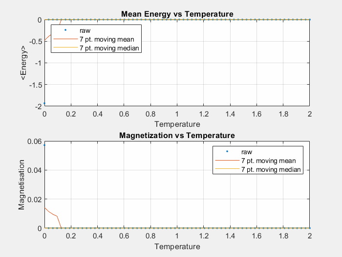
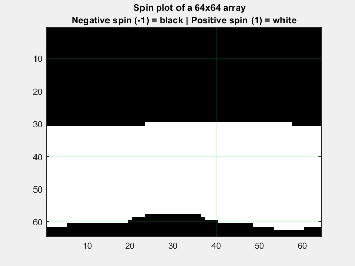

# 2-D-Ising-Model-MATLAB-

## Requirements

* MATLAB
* Parallel computing toobox (for parallel implementation)

## Series Implementations of the Ising model on ferromagnets

Download and save the following files in the same directory to run the model in series:
* initSpins.m
* metropolis.m
* energyIsing.m
* magnetisationIsing.m
* mainSeries.m

Add the following files in the same directory to plot the results for spin configuration and magnetisation changes:
* linePlot.m
* imagePlot.m

Run mainSeries.m and allowing some time for the process to finish running. After the process is finished running an animated gif of each plot will be created in your local directory to view the animated results of the simulation. An example of the expected results is shown below.

---

lineplot.m displays the change in magnetisation and energy levels of a 2-D array representing a ferromagnet with increasing temperature. The plot shows as temperature increases the energy of the system increases and its magnetic field decreases.

imagePlot.m displays the change in spin configuration of each element (microstate) in the 2-D array with increasing temperature. As temperature increases the ratio of negative and positive spins even out, decreasing the overall magnetic field around the ferromagnet.

top

bottom
